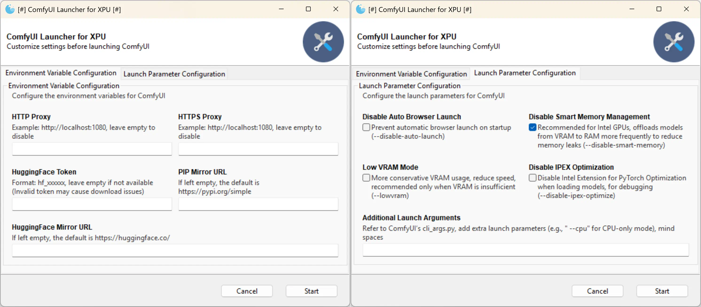

[.text-center]
English | *link:README.zh.adoc[中文说明]*

# ComfyUI Windows Portable Package for Intel GPU|XPU

image::docs/screenshot.webp["Screenshot"]

Similar to the official ComfyUI 
https://github.com/comfyanonymous/ComfyUI/releases[Standalone Portable]
package, but built for Intel GPUs.

This project is derived from
https://github.com/YanWenKun/ComfyUI-Windows-Portable/tree/v8.1[ComfyUI-Windows-Portable].

## Supported Intel GPUs (CPUs)

* Arc B
** B580, B570, and subsequent Battlemage series GPUs
* Arc A
** A770, A750, A580, A770M, A730M, A550M, Flex 170
* Arrow Lake-H
** 285H, 265H, 255H, 235H, 225H
* Lunar Lake-V
** 288V, 268V, 266V, 258V, 256V, 238V, 236V, 228V, 226V
* Meteor Lake-H
** 185H, 165H, 155H, 135H, 125H, 165HL, 155HL, 135HL, 125HL

For more information, refer to
https://docs.pytorch.org/docs/stable/notes/get_start_xpu.html[PyTorch Documentation].

## Other Features

* Only a few functional models are pre-installed. Users please prepare SD models of your favorite.

* Pre-installed 40+ commonly used custom nodes. See <<custom-nodes, Full List>>.

** Dependencies (200+ compatible Python packages) are pre-configured, including those that require compilation like `insightface` and `dlib`.
** Pre-downloaded some model files, including those for
https://github.com/Gourieff/comfyui-reactor-node[ReActor Node]
and
https://github.com/ltdrdata/ComfyUI-Impact-Pack[Impact Pack],
to avoid download delays during the first launch (which may cause freezing for users with a poor Internet connection).

* Built using GitHub CI/CD pipelines for easy DIY. Users don't need to configure CI/CD; just fork the repository on GitHub and run the build script. See <<build-your-own, Creating Your Own AIO Package>>.

## How to Use

. Install the latest
https://www.intel.com/content/www/us/en/products/docs/discrete-gpus/arc/software/drivers.html[Intel GPU Drivers].

. Install the latest VC++ Runtime
(
https://learn.microsoft.com/en-us/cpp/windows/latest-supported-vc-redist?view=msvc-170#latest-microsoft-visual-c-redistributable-version[Microsoft Page]
|
https://aka.ms/vs/17/release/vc_redist.x64.exe[Direct Download]
)

. Download the package from the
https://github.com/YanWenKun/ComfyUI-WinPortable-XPU/releases[Releases Page],
or use the direct download links:

** https://github.com/YanWenKun/ComfyUI-WinPortable-XPU/releases/download/r5/ComfyUI_Windows_portable_xpu.7z.001[ComfyUI_Windows_portable_xpu.7z.001]

** https://github.com/YanWenKun/ComfyUI-WinPortable-XPU/releases/download/r5/ComfyUI_Windows_portable_xpu.7z.002[ComfyUI_Windows_portable_xpu.7z.002]

** https://github.com/YanWenKun/ComfyUI-WinPortable-XPU/releases/download/r5/models.zip.001[models.zip.001] (Model package, only needs to be downloaded once, no need to re-download for future updates)

. Extract the `.7z.001` file (recommended not to place it in a deep directory), and extract the `.zip.001` file to the same directory.

. Place SD models under `ComfyUI\models\checkpoints`.

** You can create subdirectories for better organization.

. Run `RUN_Launcher.bat` to start.

* After launching, the program will automatically open a browser. You can also manually access: http://localhost:8188/.

* Close the window to exit the program.

## Known Issues

Test results on Arc B580 (12G) are as follows:

[%autowidth,cols=2]
|===

|SD 1.5
|🆗 Fast

|SDXL
|🆗 Fast

|Playground 2.5
|🆗 Fast

|Stable Cascade
|🆗 Very fast

|FLUX.1
|❌ Generates noise (static) image 

|SD 3.5
|🆗 Good

|===

Current known issues:

. https://github.com/Gourieff/ComfyUI-ReActor[ReActor] will fail to load. This is intentional because it requires NumPy1, which conflicts with OpenCV (requires NumPy2).

** You can simply fix this by clicking "Try Fix" in ComfyUI-Manager, and it will override NumPy2 with NumPy1. OpenCV can work on NumPy1 but with some limitations.

. Once VRAM overflows, the program crashes or freezes and needs to be restarted. Adding the `--disable-smart-memory` parameter by default alleviates this issue.

** Using "Disable Smart Memory Management" will increase model loading time. If you only use a single model after launching, you can disable this option to save time.

** Try to avoid using different major types of models in a single session (e.g., running an SD 3.5 workflow followed by an SDXL workflow) to reduce VRAM leaks.

** Closing GPU-accelerated programs (e.g., browsers) can free up some VRAM. After closing the browser, the program continues to run, and you can check the generation progress in the log window.

. In current version (PyTorch 2.8.0), the XPU performance on Windows is inferior than that on Linux.
It's using more VRAM and is compatible with less models, although the inference speed is similar. WSL2 has not been tested.

** https://github.com/YanWenKun/ComfyUI-Docker/tree/main/xpu[Docker image for XPU]

## Usage Tips

. The `ExtraScripts` folder contains command-line launch scripts, which are equivalent to the launcher. If you are a user of
https://github.com/YanWenKun/ComfyUI-Windows-Portable/[ComfyUI-Windows-Portable],
you should be familiar with this.

. Make good use of ComfyUI-Manager (the *Manager* button in the top-right corner of the ComfyUI page) to manage custom nodes: install, update, disable, and uninstall.
** Be cautious with "Update All"; there's no need to update unused nodes to avoid Python package conflicts.

. If you dislike temporary files and download caches generated by the program, consider using https://github.com/sandboxie-plus/Sandboxie/releases[Sandboxie] to constrain them and isolate the environment.
** When using Sandboxie, for I/O performance, it is recommended to configure the program's main directory (`ComfyUI_Windows_portable`) as "Open Access" in "Sandbox Options" -> "Resource Access".

### 4. External Model Directory

If you place model files on different partitions or share a set of model files across multiple ComfyUI instances,
you can configure ComfyUI to load external model directories:

* Rename `extra_model_paths.yaml.example` in the `ComfyUI` directory, removing the `.example` suffix.

* Edit `extra_model_paths.yaml`, where lines starting with `#` are comments.

.Reference file (click to expand)
[%collapsible]
====
----
comfyui:
    base_path: D:\models\
    animatediff_models: animatediff_models
    animatediff_motion_lora: animatediff_motion_lora
    bert-base-uncased: bert-base-uncased
    checkpoints: checkpoints
    clip: clip
    clip_vision: clip_vision
    configs: configs
    controlnet: controlnet
    depthfm: depthfm
    diffusers: diffusers
    diffusion_models: |
        diffusion_models
        unet
    embeddings: embeddings
    facerestore_models: facerestore_models
    gligen: gligen
    grounding-dino: grounding-dino
    hypernetworks: hypernetworks
    insightface: insightface
    instantid: instantid
    ipadapter: ipadapter
    loras: loras
    mmdets: mmdets
    onnx: onnx
    photomaker: photomaker
    reactor: reactor
    rembg: rembg
    sams: sams
    style_models: style_models
    text_encoders: text_encoders
    ultralytics: ultralytics
    unet: unet
    upscale_models: upscale_models
    vae: vae
    vae_approx: vae_approx
----
====

### 5. More External Model Directories

ComfyUI has five common locations for saving model files:

* The built-in `ComfyUI\models` directory.
* External model directories configured via `extra_model_paths.yaml`.
* Model files downloaded via HuggingFace Hub (HF official downloader).
* Model files downloaded via PyTorch.
* Files downloaded in-place by nodes in `ComfyUI\custom_nodes`.

Among these:

* HF Hub defaults to downloading files to `C:\Users\UserName\.cache\huggingface\hub`.
* PyTorch defaults to downloading files to `C:\Users\UserName\.cache\torch\hub`.

This package modifies the launch script to redirect these to the program's root directory, under `HuggingFaceHub` and `TorchHome` folders, respectively, for easier management. If needed, you can edit the launch script to change these paths.

### 6. How to Perform a "Refresh" Major Update

This method does not use ComfyUI-Manager for updates but directly replaces the package with a new version.
If the process goes smoothly, it avoids installing or upgrading Python packages, thus preventing dependency conflicts.

. Extract the new package.
. Delete the `ComfyUI`, `HuggingFaceHub`, and `TorchHome` folders in the new package.
. Copy (or move) these three folders from the old package to the new one.
. Run `RUN_Force_Updater.bat` in the new package's root directory.
. If any nodes fail to load, use ComfyUI-Manager to "try fix."

[[custom-nodes]]
## Pre-installed Custom Nodes List

[cols=3]
|===
3+|**Workspace**
|link:https://github.com/Comfy-Org/ComfyUI-Manager[ComfyUI Manager]
|link:https://github.com/crystian/ComfyUI-Crystools[Crystools]
|link:https://github.com/pydn/ComfyUI-to-Python-Extension[ComfyUI-to-Python-Extension]
3+|**Performance**
|link:https://github.com/city96/ComfyUI-GGUF[GGUF]
|link:https://github.com/welltop-cn/ComfyUI-TeaCache[TeaCache]
|link:https://github.com/openvino-dev-samples/comfyui_openvino[OpenVINO]
3+|**General**
|link:https://github.com/akatz-ai/ComfyUI-AKatz-Nodes[AKatz Nodes]
|link:https://github.com/Suzie1/ComfyUI_Comfyroll_CustomNodes.git[Comfyroll Studio]
|link:https://github.com/cubiq/ComfyUI_essentials[ComfyUI Essentials by cubiq]
|link:https://github.com/Derfuu/Derfuu_ComfyUI_ModdedNodes.git[Derfuu Modded Nodes]
|link:https://github.com/pythongosssss/ComfyUI-Custom-Scripts[Custom Scripts by pythongosssss]
|link:https://github.com/jags111/efficiency-nodes-comfyui[Efficiency Nodes by jags111]
|link:https://github.com/Amorano/Jovimetrix[Jovimetrix]
|link:https://github.com/kijai/ComfyUI-KJNodes[KJNodes]
|link:https://github.com/bash-j/mikey_nodes[Mikey Nodes]
|link:https://github.com/mirabarukaso/ComfyUI_Mira[Mira Nodes]
|link:https://github.com/rgthree/rgthree-comfy[rgthree Nodes]
|link:https://github.com/shiimizu/ComfyUI_smZNodes[smZ(shiimizu) Nodes]
|link:https://github.com/chrisgoringe/cg-use-everywhere[Use Everywhere]
|link:https://github.com/ltdrdata/was-node-suite-comfyui[WAS Node Suite]
|link:https://github.com/yolain/ComfyUI-Easy-Use[ComfyUI-Easy-Use]
3+|**Control**
|link:https://github.com/Kosinkadink/ComfyUI-Advanced-ControlNet[Advanced ControlNet]
|link:https://github.com/Fannovel16/comfyui_controlnet_aux[ControlNet Auxiliary Preprocessors]
|link:https://github.com/Jonseed/ComfyUI-Detail-Daemon[Detail Daemon]
|link:https://github.com/huchenlei/ComfyUI-IC-Light-Native[IC-Light Native]
|link:https://github.com/ltdrdata/ComfyUI-Impact-Pack[Impact Pack]
|link:https://github.com/ltdrdata/ComfyUI-Impact-Subpack[Impact Subpack]
|link:https://github.com/ltdrdata/ComfyUI-Inspire-Pack[Inspire Pack]
|link:https://github.com/cubiq/ComfyUI_InstantID[InstantID by cubiq]
|link:https://github.com/cubiq/ComfyUI_IPAdapter_plus[IPAdapter plus]
|link:https://github.com/chflame163/ComfyUI_LayerStyle[Layer Style]
|link:https://github.com/cubiq/PuLID_ComfyUI[PuLID by cubiq]
|link:https://github.com/huchenlei/ComfyUI-layerdiffuse[LayerDiffuse]
|link:https://github.com/florestefano1975/comfyui-portrait-master[Portrait Master]
|link:https://github.com/Gourieff/ComfyUI-ReActor[ReActor Node]
|link:https://github.com/mcmonkeyprojects/sd-dynamic-thresholding[SD Dynamic Thresholding]
|link:https://github.com/twri/sdxl_prompt_styler[SDXL Prompt Styler]
|
|
3+|**Video**
|link:https://github.com/Kosinkadink/ComfyUI-AnimateDiff-Evolved[AnimateDiff Evolved]
|link:https://github.com/FizzleDorf/ComfyUI_FizzNodes[FizzNodes]
|link:https://github.com/Fannovel16/ComfyUI-Frame-Interpolation[Frame Interpolation (VFI)]
|link:https://github.com/melMass/comfy_mtb[MTB Nodes]
|link:https://github.com/Kosinkadink/ComfyUI-VideoHelperSuite[Video Helper Suite]
|
3+|**More**
|link:https://github.com/kijai/ComfyUI-DepthAnythingV2[Depth Anything V2 by kijai]
|link:https://github.com/akatz-ai/ComfyUI-DepthCrafter-Nodes[DepthCrafter by akatz]
|link:https://github.com/cubiq/ComfyUI_FaceAnalysis[Face Analysis by cubiq]
|link:https://github.com/kijai/ComfyUI-Florence2[Florence-2 by kijai]
|link:https://github.com/SLAPaper/ComfyUI-Image-Selector[Image Selector]
|link:https://github.com/digitaljohn/comfyui-propost[ProPost]
|link:https://github.com/neverbiasu/ComfyUI-SAM2[Segment Anything 2 by neverbiasu]
|link:https://github.com/ssitu/ComfyUI_UltimateSDUpscale.git[Ultimate SD Upscale]
|link:https://github.com/pythongosssss/ComfyUI-WD14-Tagger[WD 1.4 Tagger]
|
|
|===

If you encounter compatibility issues after installing new nodes, you can disable conflicting nodes in ComfyUI-Manager.

[[build-your-own]]
## Creating Your Own All-In-One Package

image:https://github.com/YanWenKun/ComfyUI-WinPortable-XPU/actions/workflows/build.yml/badge.svg["GitHub Workflow Status",link="https://github.com/YanWenKun/ComfyUI-WinPortable-XPU/actions/workflows/build.yml"]

This repository utilizes a pipeline to build the package, and the codebase doesn't contain specific configurations or require additional access permissions. Hence, you can directly fork this repository to start executing the GitHub Workflow.

1. After forking, find *Actions* on the page.
2. Locate *Build & Upload Package*.
** For example, the page in my repository looks like
https://github.com/YanWenKun/ComfyUI-WinPortable-XPU/actions/workflows/build.yml[this].
3. Click *Run Workflow*.
4. Wait about 20~40 minutes until the workflow run complete.
5. Go to the *releases* page of your repository, where you will find the newly generated draft, ready for download or editing.
