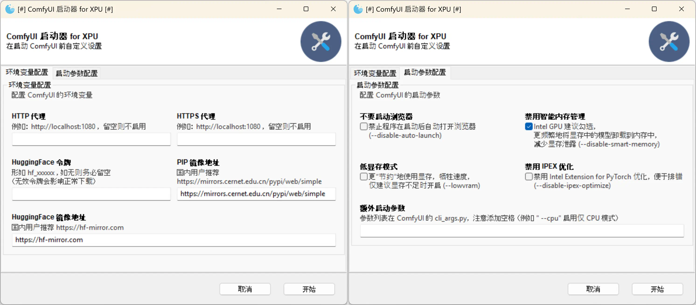

# ComfyUI Windows 整合包，适配 Intel GPU|XPU

image::docs/screenshot.webp["界面截图"]

[.text-center]
中文 | *link:README.adoc[English]*

类似 ComfyUI 官方的
https://github.com/comfyanonymous/ComfyUI/releases[Standalone Portable]
整合包，适配 Intel GPU。

本项目修改自
https://github.com/YanWenKun/ComfyUI-Windows-Portable/tree/v8.1[ComfyUI-Windows-Portable] 。

## 支持的 Intel GPU (CPU)

* Arc B
** B580, B570, 以及后续 Battlemage 系列显卡
* Arc A
** A770, A750, A580, A770M, A730M, A550M, Flex 170
* Arrow Lake-H
** 285H, 265H, 255H, 235H, 225H
* Lunar Lake-V
** 288V, 268V, 266V, 258V, 256V, 238V, 236V, 228V, 226V
* Meteor Lake-H
** 185H, 165H, 155H, 135H, 125H, 165HL, 155HL, 135HL, 125HL

更多兼容性信息参考
https://docs.pytorch.org/docs/stable/notes/get_start_xpu.html[PyTorch 文档] 。

## 其他特点

* 仅预置了少量功能性模型，绘图模型还请用户自行下载

* 预装了 40+ 常用自定义节点 <<custom-nodes, 【查看详细列表】>>

** 调整安装好了依赖项（200+ 互相兼容的 Python 包），包括需要编译安装的 `insightface`、`dlib` 等。
** 预先下载了部分模型文件，包括
https://github.com/Gourieff/comfyui-reactor-node[ReActor Node]
与
https://github.com/ltdrdata/ComfyUI-Impact-Pack[Impact Pack]
会在初次启动时下载的模型文件等，避免国内用户启动时卡下载。

* 使用 GitHub 流水线打包，方便 DIY。用户无需配置 CI/CD，只需在 GitHub 上 Fork 仓库，即可运行打包脚本 <<build-your-own, 【查看操作方法】>>

## 如何使用

. 安装好最新 https://www.intel.cn/content/www/cn/zh/products/docs/discrete-gpus/arc/software/drivers.html[Intel 显卡驱动]

. 安装好最新 VC++ 运行时
（
https://learn.microsoft.com/zh-cn/cpp/windows/latest-supported-vc-redist?view=msvc-170#latest-microsoft-visual-c-redistributable-version[微软页面]
|
https://aka.ms/vs/17/release/vc_redist.x64.exe[直接下载]
）

. 在
https://github.com/YanWenKun/ComfyUI-WinPortable-XPU/releases[发布页面]
下载整合包文件，或者直接下载链接：

** https://github.com/YanWenKun/ComfyUI-WinPortable-XPU/releases/download/r5/ComfyUI_Windows_portable_xpu.7z.001[ComfyUI_Windows_portable_xpu.7z.001]

** https://github.com/YanWenKun/ComfyUI-WinPortable-XPU/releases/download/r5/ComfyUI_Windows_portable_xpu.7z.002[ComfyUI_Windows_portable_xpu.7z.002]

** https://github.com/YanWenKun/ComfyUI-WinPortable-XPU/releases/download/r5/models.zip.001[models.zip.001] （模型包，只需下载一次，以后升级无需重复下载）

. 打开 `.7z.001` 并解压（建议不要放在太深的目录），打开 `.zip.001` 并解压到同一个目录

. 将 SD 模型放到 `ComfyUI\models\checkpoints` 下

** 可随意建立子目录，便于分类

. 运行 `启动器.bat` 即可启动

* 启动后程序会自动打开浏览器，也可手动访问： http://localhost:8188/

* 关闭窗口即可退出程序

## 已知问题

在 Arc B580 (12G) 测试结果如下：

[%autowidth,cols=2]
|===

|SD 1.5
|🆗 很快

|SDXL
|🆗 很快

|Playground 2.5
|🆗 很快

|Stable Cascade
|🆗 特别快

|FLUX.1
|❌ 生成噪声图（雪花图）

|SD 3.5
|🆗 正常

|===

目前已知问题：

. https://github.com/Gourieff/ComfyUI-ReActor[ReActor] 节点不会正常加载，这是有意取舍，它依赖 NumPy1，与 OpenCV（依赖 NumPy2）冲突。

** 如需反向取舍，在 ComfyUI-Manager 中找到 ReActor 并点击“Try Fix”，它会用 NumPy1 覆盖 NumPy2。OpenCV 在 NumPy1 下也能勉强工作，但仅限加载不报错，行为未知。

. 一旦显存溢出，程序即崩溃或假死，需要重新启动。默认添加参数 `--disable-smart-memory` 后有所缓解。

** 勾选“禁用智能内存管理”会使模型运行完即释放显存，不会一直缓存于显存中，但该设置会增加模型加载用时。如果本次程序启动后只使用单一模型，也可取消勾选。

** 尽量避免在一次启动中使用不同大类的模型（比如先运行 SD 3.5 再运行 SDXL）以减少显存泄漏。

** 关闭使用 GPU 加速的程序（比如浏览器）可释放一部分显存。关闭浏览器后程序仍然在运行，可在日志窗口查看生成进度。

. 当前版本（PyTorch 2.8.0）下，XPU 在 Windows 的表现不如 Linux。
在 Windows 上显存占用更高，兼容的模型更少，不过推理速度相近。WSL2 未测试。

** https://github.com/YanWenKun/ComfyUI-Docker/tree/main/xpu-cn[用于 XPU 的 ComfyUI Docker 镜像]

## 使用技巧

. `备用脚本` 文件夹下包含了命令行启动脚本，其内容与启动器等价。如果你是
https://github.com/YanWenKun/ComfyUI-Windows-Portable/[ComfyUI-Windows-Portable]
的老用户，应该会比较熟悉。

. 善加利用 ComfyUI-Manager （ComfyUI 页面右上角 *Manager* 按钮），用它来管理自定义节点：安装、更新、禁用、卸载。
** “更新全部”需谨慎，用不到的节点没必要更新，避免 Python 包混乱。

. 如果你讨厌程序产生的临时文件、下载缓存等，可以考虑使用 https://github.com/sandboxie-plus/Sandboxie/releases[Sandboxie] 沙盒来约束它们，同时隔离环境。
** 在使用沙盒时，为了 I/O 性能，建议在“沙盒选项”-“资源访问”中，将程序主目录（`ComfyUI_Windows_portable`）配置为“开放”。

### 4. 外部模型目录

如果你将模型文件放在不同的分区，或者多个 ComfyUI 实例共用一套模型文件，
可以配置 ComfyUI 加载外部模型目录：

* 将 `ComfyUI` 目录下的 `extra_model_paths.yaml.example` 重命名，去掉末尾的 `.example`

* 编辑 `extra_model_paths.yaml`，其中以 `#` 开头的部分为注释内容

.参考文件（点击展开）
[%collapsible]
====
----
comfyui:
    base_path: D:\models\
    animatediff_models: animatediff_models
    animatediff_motion_lora: animatediff_motion_lora
    bert-base-uncased: bert-base-uncased
    checkpoints: checkpoints
    clip: clip
    clip_vision: clip_vision
    configs: configs
    controlnet: controlnet
    depthfm: depthfm
    diffusers: diffusers
    diffusion_models: |
        diffusion_models
        unet
    embeddings: embeddings
    facerestore_models: facerestore_models
    gligen: gligen
    grounding-dino: grounding-dino
    hypernetworks: hypernetworks
    insightface: insightface
    instantid: instantid
    ipadapter: ipadapter
    loras: loras
    mmdets: mmdets
    onnx: onnx
    photomaker: photomaker
    reactor: reactor
    rembg: rembg
    sams: sams
    style_models: style_models
    text_encoders: text_encoders
    ultralytics: ultralytics
    unet: unet
    upscale_models: upscale_models
    vae: vae
    vae_approx: vae_approx
----
====

### 5. 更多外部模型目录

ComfyUI 有五处常见的模型文件保存位置：

* 内置的 `ComfyUI\models` 目录
* 通过 `extra_model_paths.yaml` 配置的外部模型目录
* 通过 HuggingFace Hub（HF 官方下载器）下载的模型文件
* 通过 PyTorch 下载的模型文件
* 各节点在 `ComfyUI\custom_nodes` 中原地下载的文件

其中：

* HF Hub 默认将文件下载到 `C:\Users\UserName\.cache\huggingface\hub`
* PyTorch 默认将文件下载到 `C:\Users\UserName\.cache\torch\hub`

本整合包在启动脚本中，将这两者修改到了程序根目录下，分别为 `HuggingFaceHub` 与 `TorchHome` 文件夹，以便用户直观管理。如需修改，可在启动脚本中编辑。

### 6. 如何“翻新式”大更新

该方法不通过 ComfyUI-Manager 更新，而是直接替换为新版整合包。
如果流程顺利，可以避免安装升级 Python 包，进而避免依赖项版本混乱。

. 解压新版整合包
. 删除新版中的 `ComfyUI` 、 `HuggingFaceHub` 与 `TorchHome` 文件夹
. 将旧版中的这三个文件夹复制（移动）过来
. 在新版主目录下，运行 `强制更新（从国内镜像下载）.bat`
. 如有节点加载失败，需在 ComfyUI-Manager 中“try fix”。

[[custom-nodes]]
## 预装自定义节点列表

.工作空间
[cols=3]
|===
|link:https://github.com/Comfy-Org/ComfyUI-Manager[ComfyUI Manager]
|link:https://github.com/crystian/ComfyUI-Crystools[Crystools]
|link:https://github.com/pydn/ComfyUI-to-Python-Extension[ComfyUI-to-Python-Extension]
|
|
|===

.性能
[cols=3]
|===
|link:https://github.com/city96/ComfyUI-GGUF[GGUF]
|link:https://github.com/welltop-cn/ComfyUI-TeaCache[TeaCache]
|link:https://github.com/openvino-dev-samples/comfyui_openvino[OpenVINO]
|
|
|===

.综合
[cols=3]
|===
|link:https://github.com/akatz-ai/ComfyUI-AKatz-Nodes[AKatz Nodes]
|link:https://github.com/Suzie1/ComfyUI_Comfyroll_CustomNodes.git[Comfyroll Studio]
|link:https://github.com/cubiq/ComfyUI_essentials[ComfyUI Essentials by cubiq]
|link:https://github.com/Derfuu/Derfuu_ComfyUI_ModdedNodes.git[Derfuu Modded Nodes]
|link:https://github.com/pythongosssss/ComfyUI-Custom-Scripts[Custom Scripts by pythongosssss]
|link:https://github.com/jags111/efficiency-nodes-comfyui[Efficiency Nodes by jags111]
|link:https://github.com/Amorano/Jovimetrix[Jovimetrix]
|link:https://github.com/kijai/ComfyUI-KJNodes[KJNodes]
|link:https://github.com/bash-j/mikey_nodes[Mikey Nodes]
|link:https://github.com/mirabarukaso/ComfyUI_Mira[Mira Nodes]
|link:https://github.com/rgthree/rgthree-comfy[rgthree Nodes]
|link:https://github.com/shiimizu/ComfyUI_smZNodes[smZ(shiimizu) Nodes]
|link:https://github.com/chrisgoringe/cg-use-everywhere[Use Everywhere]
|link:https://github.com/ltdrdata/was-node-suite-comfyui[WAS Node Suite]
|link:https://github.com/yolain/ComfyUI-Easy-Use[ComfyUI-Easy-Use]
|
|
|===

.控制
[cols=3]
|===
|link:https://github.com/Kosinkadink/ComfyUI-Advanced-ControlNet[Advanced ControlNet]
|link:https://github.com/Fannovel16/comfyui_controlnet_aux[ControlNet Auxiliary Preprocessors]
|link:https://github.com/Jonseed/ComfyUI-Detail-Daemon[Detail Daemon]
|link:https://github.com/huchenlei/ComfyUI-IC-Light-Native[IC-Light Native]
|link:https://github.com/ltdrdata/ComfyUI-Impact-Pack[Impact Pack]
|link:https://github.com/ltdrdata/ComfyUI-Impact-Subpack[Impact Subpack]
|link:https://github.com/ltdrdata/ComfyUI-Inspire-Pack[Inspire Pack]
|link:https://github.com/cubiq/ComfyUI_InstantID[InstantID by cubiq]
|link:https://github.com/cubiq/ComfyUI_IPAdapter_plus[IPAdapter plus]
|link:https://github.com/chflame163/ComfyUI_LayerStyle[Layer Style]
|link:https://github.com/cubiq/PuLID_ComfyUI[PuLID by cubiq]
|link:https://github.com/huchenlei/ComfyUI-layerdiffuse[LayerDiffuse]
|link:https://github.com/florestefano1975/comfyui-portrait-master[Portrait Master]
|link:https://github.com/Gourieff/ComfyUI-ReActor[ReActor Node]
|link:https://github.com/mcmonkeyprojects/sd-dynamic-thresholding[SD Dynamic Thresholding]
|link:https://github.com/twri/sdxl_prompt_styler[SDXL Prompt Styler]
|
|
|===

.视频
[cols=3]
|===
|link:https://github.com/Kosinkadink/ComfyUI-AnimateDiff-Evolved[AnimateDiff Evolved]
|link:https://github.com/FizzleDorf/ComfyUI_FizzNodes[FizzNodes]
|link:https://github.com/Fannovel16/ComfyUI-Frame-Interpolation[Frame Interpolation (VFI)]
|link:https://github.com/melMass/comfy_mtb[MTB Nodes]
|link:https://github.com/Kosinkadink/ComfyUI-VideoHelperSuite[Video Helper Suite]
|
|
|===

.更多
[cols=3]
|===
|link:https://github.com/kijai/ComfyUI-DepthAnythingV2[Depth Anything V2 by kijai]
|link:https://github.com/akatz-ai/ComfyUI-DepthCrafter-Nodes[DepthCrafter by akatz]
|link:https://github.com/cubiq/ComfyUI_FaceAnalysis[Face Analysis by cubiq]
|link:https://github.com/kijai/ComfyUI-Florence2[Florence-2 by kijai]
|link:https://github.com/SLAPaper/ComfyUI-Image-Selector[Image Selector]
|link:https://github.com/digitaljohn/comfyui-propost[ProPost]
|link:https://github.com/neverbiasu/ComfyUI-SAM2[Segment Anything 2 by neverbiasu]
|link:https://github.com/ssitu/ComfyUI_UltimateSDUpscale.git[Ultimate SD Upscale]
|link:https://github.com/pythongosssss/ComfyUI-WD14-Tagger[WD 1.4 Tagger]
|
|
|===

如安装新节点后遇到兼容性问题，可在 ComfyUI-Manager 中禁用冲突节点。

[[build-your-own]]
## 我也想生成整合包！

image:https://github.com/YanWenKun/ComfyUI-WinPortable-XPU/actions/workflows/build.yml/badge.svg["GitHub 工作流状态",link="https://github.com/YanWenKun/ComfyUI-WinPortable-XPU/actions/workflows/build.yml"]

本仓库使用流水线构建整合包，直接 fork 本仓库即可开始执行 GitHub Workflow。代码库中不含特化配置，也不需要额外配置访问权限。

1. Fork 后，在页面中找到 *Actions*。
2. 找到 *Build & Upload Package*。
** 比如我代码库里的页面长
https://github.com/YanWenKun/ComfyUI-WinPortable-XPU/actions/workflows/build.yml[这样]
3. 找到 *Run Workflow*，点击运行。
4. 等待执行完毕（20~40分钟）
5. 找到仓库的 *releases* 页面，里面会有刚生成的草稿，即可下载或编辑发布。
